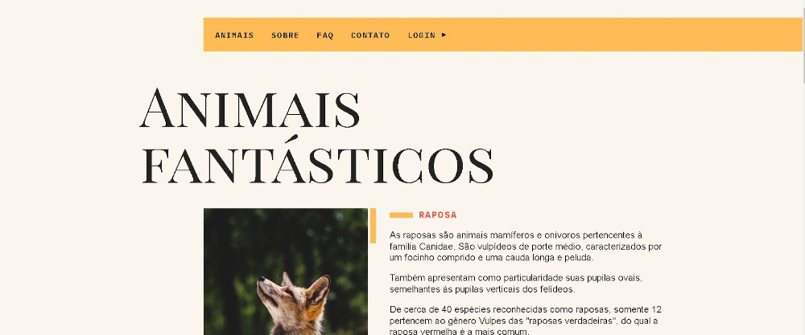

# Animais Fantásticos

<!---Esses são exemplos. Veja https://shields.io para outras pessoas ou para personalizar este conjunto de escudos. Você pode querer incluir dependências, status do projeto e informações de licença aqui--->

> Landing page criada simulando uma Ong de proteção a animais, neste website é informado as espécies que estão em processo de extinção. Para criação foi usado HTML, Css, JavaScript.

 

<h4 align="center"><a href="https://jefferson-guirra.github.io/-Projetos/projeto-02/" target="_blank">Clique para visitar o projeto</a></h4>

## 📚 Seções

O site é composto por quatro seções:

- **Home:** Nele temos uma breve apresentação sobre cada espécie;
- **Faq:** Nesta seção temos características e diferenças de cada espécie;
- **Sobre:** Apresenta a origem e finalidade da clínica;
- **Contato:** É nesta seção que se encontra o endereço e contato para doação da clínica;

---
 

## 🚀  Funcionalidades

O projeto visou o aprendizado desde o básico ao avaçando de JavaScript, criando manualmente funcionalidade como:

- Accordion-List;
- Modal;
- Slide;
- Animar ao scroll;

### Ajustes e melhorias

O projeto foi concluído e todas as tarefas finalizadas:

- [x] Tarefa 1
- [x] Tarefa 2
- [x] Tarefa 3
- [x] Tarefa 4
- [x] Tarefa 5

* Compatível `<Windows / Linux / Mac>`." alt="Doctor Care">

 

